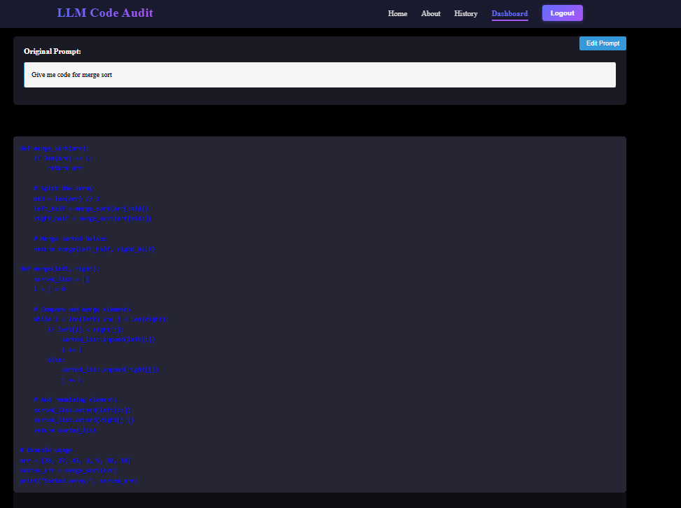
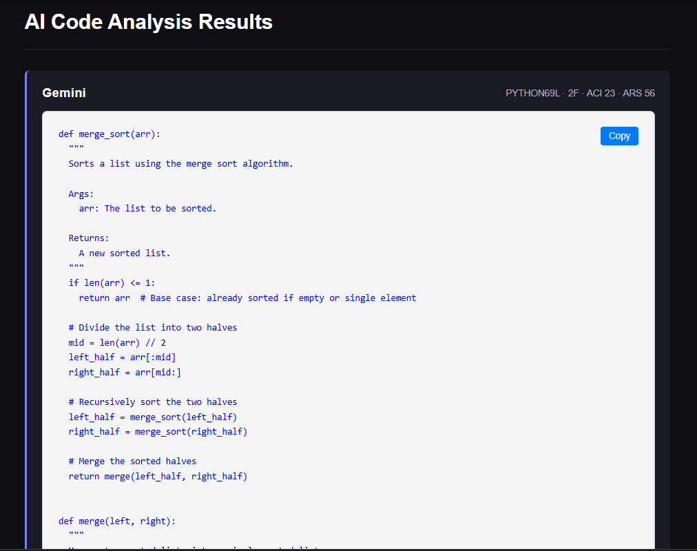
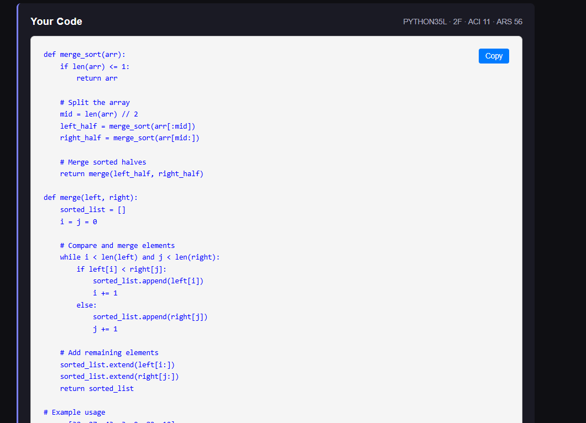
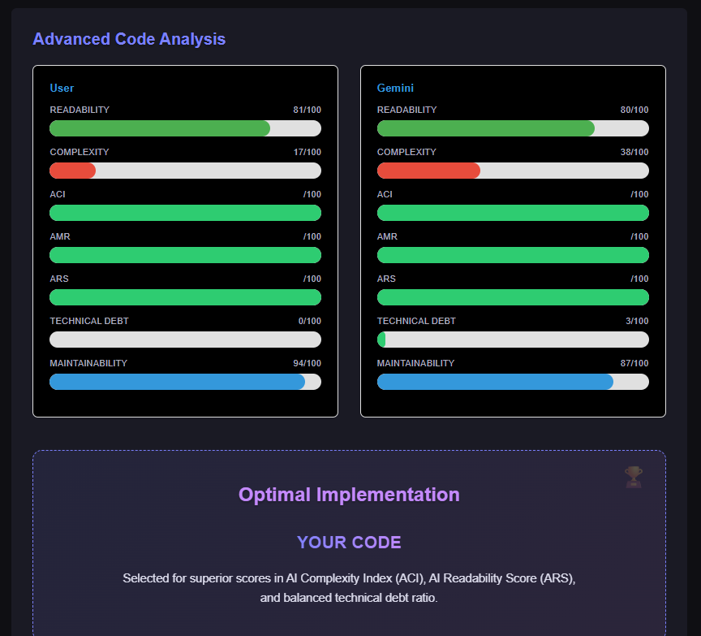
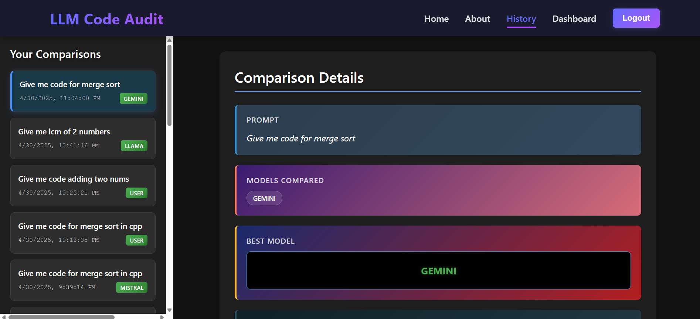

# 🤖 LLM Code Audit - Comprehensive Documentation

A smart auditing tool that helps developers compare and evaluate AI-generated code from multiple LLMs like ChatGPT, Gemini, DeepSeek, LLaMA, and Mistral.

---

## 🧭 Table of Contents
1. [Introduction](#introduction)
2. [Problem Statement](#problem-statement)
3. [Solution Overview](#solution-overview)
4. [Features](#features)
5. [Technical Architecture](#technical-architecture)
6. [File Structure](#file-structure)
7. [Detailed Page Descriptions](#detailed-page-descriptions)
8. [Metrics Explanation](#metrics-explanation)
9. [Conclusion](#conclusion)

---

## 📌 Introduction


**LLM Code Audit** helps developers analyze and compare code generated by multiple AI tools to identify the best-performing and most maintainable solution.

---

## ❗ Problem Statement

### 🔍 The Problem
- AI-generated code is often unoptimized or poorly structured.
- Manually comparing outputs is tedious and error-prone.
- Lack of tools that provide actionable feedback and ranking across LLMs.


### 🧪 Why Current Tools Fall Short
- Tools like SonarQube evaluate only post-development.
- No side-by-side LLM comparisons.
- No automatic quality metrics or recommendations.

---

## ✅ Solution Overview






**LLM Code Audit** provides:
- 🚀 Multi-LLM integration
- 📊 AI code comparison
- 🧠 20+ quality metrics
- 🎯 Scoring and suggestions

---

## ⚙ Features

### 1. 🧠 Multi-LLM Code Generation
- One prompt → multiple AI outputs
- Side-by-side comparison
- Add user code for evaluation

### 2. 🧪 Advanced Code Analysis
- Detects code issues
- Auto-scores and recommends best output

### 3. 📐 Smart Metrics System
- ACI (Complexity)
- AMR (Maintainability Risk)
- ARS (Readability)
- ADR (Dependency Risk)
- ARF (Redundancy)

### 4. 🕓 History Tracking

- Stores prompts and outputs
- Tracks best LLM per prompt
- Allows re-analysis

### 5. 🧭 User-Friendly Interface
- Minimal, modern UI
- Interactive visualizations
- Fully responsive

---

## 🧱 Technical Architecture

### Frontend
- React.js with Vite
- Modular components
- Styled using custom CSS

### Backend
- Node.js
- Firebase Authentication
- Firestore for prompt/output storage

### AI Integrations
- ChatGPT
- Gemini
- DeepSeek
- LLaMA
- Mistral


---

## 🗂 File Structure

```txt
node_modules/
public/
src/
├── api/
├── assets/
├── backend/
├── components/
│   ├── AuthModal.jsx
│   ├── Header.jsx
│   ├── HistoryItem.jsx
│   ├── QueryInput.jsx
│   └── ResultsDisplay.jsx
├── hooks/
├── pages/
│   ├── AboutPage.jsx
│   ├── AuthPage.jsx
│   ├── ComparisonDetail.jsx
│   ├── Dashboard.jsx
│   ├── HistoryPage.jsx
│   └── HomePage.jsx
├── styles/
├── App.css
├── App.jsx
├── firebaseConfig.js
├── firestoreService.js
├── index.css
├── main.jsx
.env
.gitignore
eslint.config.js
index.html
package-lock.json
package.json
vite.config.js
