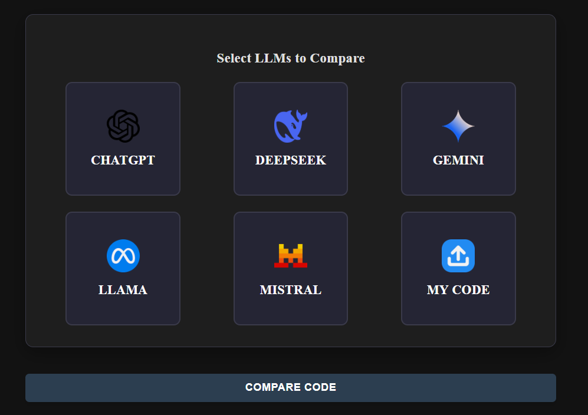
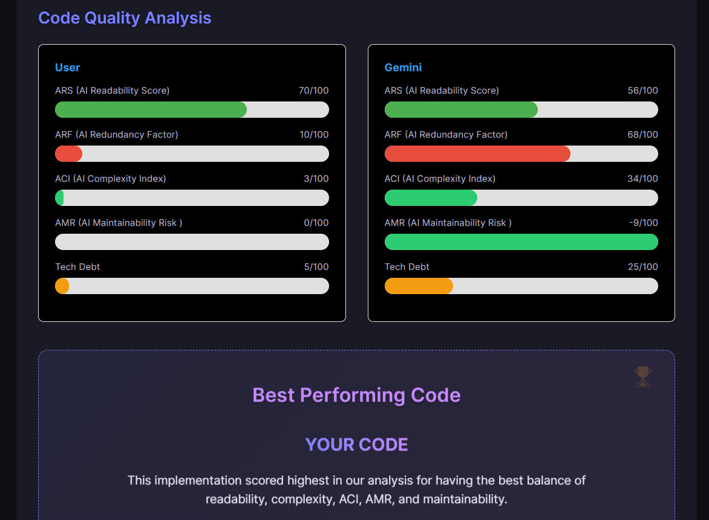

#  LLM Code Audit - Comprehensive Documentation
### Link for Video explanation and Report 
https://drive.google.com/drive/folders/1k2ILYgJU-peCaqjSyTahTIbDpPmsnpvK?usp=sharing

**LLM Code Audit** is an intelligent, developer-focused tool designed to **generate, evaluate, and compare code** outputs from multiple Large Language Models (LLMs), including **ChatGPT**, **Gemini**, **DeepSeek**, **LLaMA**, and **Mistral**.

Whether you're prototyping, benchmarking, or auditing AI-generated code, this platform helps you make **data-driven decisions** by providing detailed metrics around code complexity, maintainability, and readability. 

With real-time analysis, visual dashboards, and history tracking, LLM Code Audit enables a transparent and measurable way to choose the best code output for your needs — all in a clean, user-friendly interface.


---

##  Table of Contents
1. [Introduction](#introduction)
2. [Problem Statement](#problem-statement)
3. [Solution Overview](#solution-overview)
4. [Features](#features)
5. [Technical Architecture](#technical-architecture)
6. [File Structure](#file-structure)
7. [Detailed Page Descriptions](#detailed-page-descriptions)
8. [Metrics Explanation](#metrics-explanation)
9. [Conclusion](#conclusion)
10. [Contributions](#contributions)

---

##  Introduction




**LLM Code Audit** helps developers analyze and compare code generated by multiple AI tools to identify the best-performing and most maintainable solution.

---

##  Problem Statement

###  The Problem
- AI-generated code is often unoptimized or poorly structured.
- Manually comparing outputs is tedious and error-prone.
- Lack of tools that provide actionable feedback and ranking across LLMs.


###  Why Current Tools Fall Short
- Tools like SonarQube evaluate only post-development.
- No side-by-side LLM comparisons.
- No automatic quality metrics or recommendations.

---

##  Solution Overview




**LLM Code Audit** provides:
-  Multi-LLM integration
-  AI code comparison
-  20+ quality metrics
-  Scoring and suggestions

---

##  Features

### 1.  Multi-LLM Code Generation
- One prompt → multiple AI outputs
- Side-by-side comparison
- Add user code for evaluation

### 2.  Advanced Code Analysis
- Detects code issues
- Auto-scores and recommends best output

### 3.  Smart Metrics System
- ACI (Complexity)
- AMR (Maintainability Risk)
- ARS (Readability)
- ADR (Dependency Risk)
- ARF (Redundancy)

### 4.  History Tracking

- Stores prompts and outputs
- Tracks best LLM per prompt
- Allows re-analysis

### 5.  User-Friendly Interface
- Minimal, modern UI
- Interactive visualizations
- Fully responsive

---

##  Technical Architecture

### Frontend
- React.js with Vite
- Modular components
- Styled using custom CSS

### Backend
- Node.js
- Firebase Authentication
- Firestore for prompt/output storage

### AI Integrations
- ChatGPT
- Gemini
- DeepSeek
- LLaMA
- Mistral


---

##  File Structure

```txt
node_modules/
public/
src/
├── api/
├── assets/
├── backend/
├── components/
│   ├── AuthModal.jsx
│   ├── Header.jsx
│   ├── HistoryItem.jsx
│   ├── QueryInput.jsx
│   └── ResultsDisplay.jsx
├── hooks/
├── pages/
│   ├── AboutPage.jsx
│   ├── AuthPage.jsx
│   ├── ComparisonDetail.jsx
│   ├── Dashboard.jsx
│   ├── HistoryPage.jsx
│   └── HomePage.jsx
├── styles/
├── App.css
├── App.jsx
├── firebaseConfig.js
├── firestoreService.js
├── index.css
├── main.jsx
.env
.gitignore
eslint.config.js
index.html
package-lock.json
package.json
vite.config.js

```

---

##  Detailed Page Descriptions

###  Home Page
- Enter prompt  
- Choose LLMs  
- Add custom code  
- Click "Generate" for outputs  

###  Dashboard Page
- View AI-generated code  
- Start code evaluation

###  Results Page
- Scores and charts for each output  
- Final recommendation  

###  History Page
- View and revisit previous prompts  
- Compare LLM performance over time  

###  About Page
- Project vision  
- Team details  
- Real-world applications  

---

##  Metrics Explanation

###  AI Complexity Index (ACI)
```mathematica
ACI = (0.5 × Cognitive Complexity) + (0.3 × Method Length) + (0.2 × Nesting Level)
```
### AI Maintainability Risk (AMR)
```mathematica
AMR = (0.4 × Code Smells per 100 LOC) + (0.4 × Duplication %) + (0.2 × % Uncommented Methods)
```
###  AI Readability Score (ARS)
```mathematica
ARS = (0.4 × Avg Line Length) + (0.4 × % Comments) + (0.2 × Naming Consistency)
```


##  Conclusion

**LLM Code Audit** empowers developers to take full control over AI-generated code, ensuring quality, maintainability, and clarity before integrating into production environments.

By offering clear comparisons, actionable insights, and in-depth metrics, this tool bridges the gap between rapid AI code generation and robust software engineering standards.

>  Ready to reduce tech debt and make AI code work for you?  
>  Try **LLM Code Audit** now!


## Contributions 
### Kowshik A -CS22B004
- Release 1:
  Ideated the core concept , Use cases and Formulated AI Metrics Assisted in implementing Large Language Models (LLMs) and contributed to the iterative process of redefining the UI/UX design. Created and refined presentation slides.
- Release 2:
  Conducted in-depth research to identify and refine key metrics, integrating them into the project framework. Contributed to the enhancement of the dashboard UI/UX, developed the "About" page, and authored the final four sections of the report: Discussions, Limitations, Conclusion, and Researched References to support our Formulation.

### Nishchith G -CS22B021
- Release 1:
  Integrated multiple LLMs (OpenAI, DeepSeek, Gemini) into the system and focused on improving their code generation capabilities by analyzing outputs, fine-tuning prompts, and enhancing overall response quality for better developer utility.
- Release 2:
  Integrated multiple LLMs including LLaMA, and Mistral into the system. Focused on enhancing code generation quality through prompt optimization and output analysis. Additionally, resolved a critical bug related to user-submitted code handling and contributed to backend integration to ensure seamless functionality.

### Jaswanth G -CS22B020
- Release 1:
   I actively contributed to finalizing the project idea and played a key role in drafting the initial report. I managed repository updates on GitHub, integrated Firebase for the login page, and worked on improving the overall code structure. Additionally, I was involved in identifying and fixing several bugs to ensure smoother functionality.

- Release 2:
  I redefined and added new performance metrics to improve the system's output. I successfully structured and integrated the** complete history page**, establishing a connection with the Firestore backend. I resolved issues related to the user code prompt and helped **organize and refine the codebase further**. I also wrote the final **project report **in a professional manner, created a **video demo** to showcase the app, **updated the README file** for better documentation, and continued** fixing bugs **to enhance the overall user experience.
  
### Rohith G -CS22B022
- Release 1:
I designed the Home Page and Dashboard Page. I implemented the Home Page with prompt input functionality. My work also included web platform design, hosting integration for LLMs, front-end UI development, and writing reports.
- Release 2:
I implemented the Home Page with prompt input, model selection, and. I added the model selection functionality to allow users to compare outputs from different LLMs like ChatGPT, Gemini, DeepSeek, LLaMA, and Mistral. I redesigned the Dashboard with a new theme and improved layout, enhancing the code analysis section with progress bars. I also updated the History Page UI to improve readability and usability. Additionally, I authored the complete README documentation, including setup instructions, metric explanations, and usage guidelines.

### Rashmitha V - CS22B050
- Release 1:
   Integrated SonarQube Metrics & tried to fix the display of the generated report on the main website.
Developed the login page with firebase Authentication.
- Release 2:
   Implemented a custom code input feature , with optional file upload support via the FileReader API to analyze Custom code along with LLMs generated codes.  Handled navigation with authentication checks via useNavigate and useLocation, dynamically constructing query parameters for Custom code comparison on the dashboard . For analysis of custom code,it is linked to same logic of LLMs generated codes analysis function and displays report.

### Kalyan Anudeep - CS22B025
- Release 1:
  Implemented user prompt input with options for selecting models or entering manual code.Helped in Integrated multiple large language models (ChatGPT, Gemini, DeepSeek, Mistral, LLaMA).Helped in adding metrics like readability,lines of code etc which are calculated by some formulas
- Release 2:
  Helped in making a LaTeX-formatted technical report including system design, metric formulas, and user scenarios and the which consists all the summary of the project,,Removing bugs as if there are any errors while changing the code,Inbuilding a side-by-side model comparison dashboard with labeled outputs and integrating bar graph visualizations to display metric-wise scores across all model outputs  (code display blocks, metric cards, charts) for scalability and ease of maintenance
